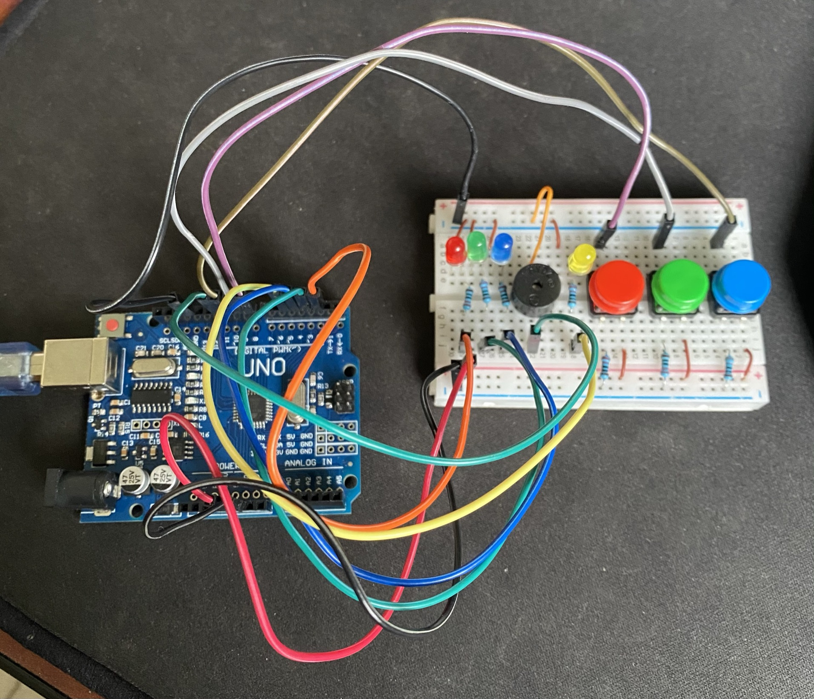

# Projeto "GENIUS" em Arduino

Meu primeiro projeto utilizando __Arduino__.

> Não foram utilizados códigos prontos ou projetos de internet, neste primeiro projeto a minha ideia foi aprender como os componentes se comportam com o código

Para os próximos passos, precisarei adquirir mais componentes e complementar este jogo.

#### Como o jogo funciona

O sistema aleatóriamente irá selecionar uma cor e pisar a led na cor correspondente, o jogador então irá apertar o botão na mesma cor.

A led na cor laranja quando acesa simboliza que é a vez do jogador.

Caso o jogador acerte a cor, o sistema irá piscar as cores anteriores e adicionar uma cor aleatória, o jogador então terá que apertar as cores anteriores e a cor atual na mesma sequência.

Este sistema irá funcionar até que o jogador consiga completar as __N__ (MAX_COLORS) jogadas do sistema.

Caso o jogador aperte incorretamente qualquer uma das cores da sequência será emitido um alerta sonoro e todas as leds ficaram acesas simbolizando que o jogador não completou o jogo.

Caso o jogador consiga acertar todas as cores em sequência, será emitido um bipe continuo com as todas as leds piscando simbolizando que o jogador completou o jogo.

Para resetar o jogo basta apertar o botão "reset" do próprio Arduino.

### Para você também poder jogar com este projeto

Sem precisar de alterações, adicionar os componentes nos pinos:

|Componente|Pino|
|-|-|
|LED vermelha|2|
|LED verde|3|
|LED azul|4|
|LED laranja|5|
|Botão vermelho|8|
|Botão verde|9|
|Botão azul|10|
|buzzer|11|

### Configurações dos pinos dos componentes

###### pinos das leds
```C
#define pinLedR 2
#define pinLedG 3
#define pinLedB 4
#define pinLedGO 5
```

###### pinos dos botões
```C
#define pinBtnR 8
#define pinBtnG 9
#define pinBtnB 10
```

###### pino do buzzer
```C
#define pinBuzz 11
```

###### número de jogadas até o jogador vencer
```C
#define MAX_COLORS 3
```

###### tempo em que a led ficará acessa
```C
#define DELAY_LED 500
```



## Próximos passos

- [ ] adicionar uma chave para alternar entre fácil/difícil (tempo da led será menor e com tempo para resposta)
- [ ]  display para contagem de tempo disponível para o jogador clicar nos botões
- [ ] display para contagem de acertos
- [ ] alertas sonoros para cada acionamento da led